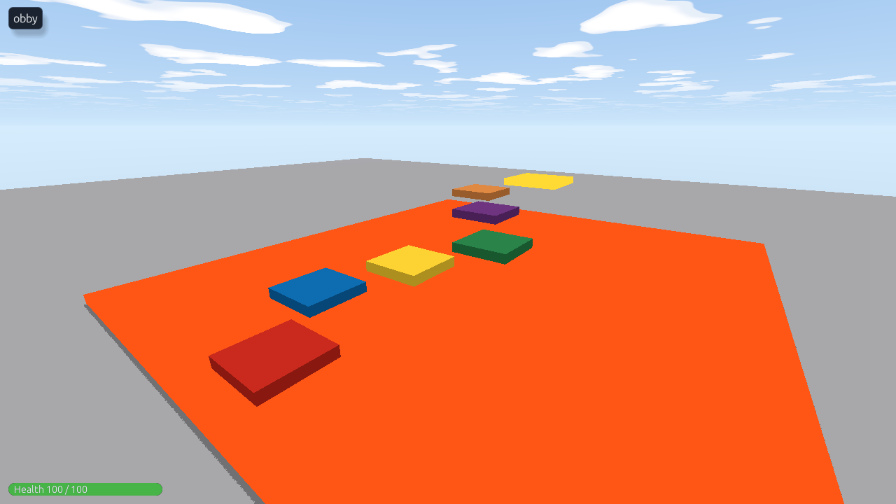
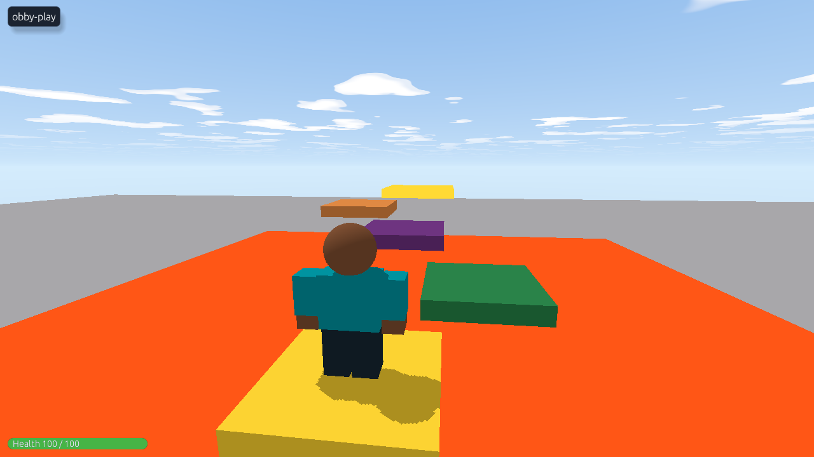

Let's make a real game: an **obby**, an obstacle course. Jump across floating platforms, don't touch the lava, and reach the gold finish pad. It takes about 15 minutes and uses almost everything from the tour.



## 1. Start clean

Studio opens with a small demo world, which is worth pressing **Play** in once to try. For your own game, clear it out: in the **Explorer**, click the first object under Workspace, **Ctrl-click** every other one *except* **Baseplate** and **SpawnLocation**, and press **Delete**.

You're left with a big grey floor and a spawn pad: where players appear.

## 2. Build the course

1. **Add Part → Part.** A grey block appears in front of the camera.
2. Pick **Scale (3)** and drag the handles to make it a platform, about 6 wide and 6 long. Or type the **Size** in **Properties**: x `6`, y `1`, z `6`.
3. Pick **Move (1)** and lift it up off the ground, a few studs in front of the spawn.
4. Press **Ctrl+D** to duplicate it, and move the copy further along. Keep going until you have a path of five or six platforms, with gaps you can just jump across (up to about 8 studs apart, and no more than 5 higher than the last).
5. Give them some color: select one and change **Color** in Properties.

> **Tip:** Players jump about 7 studs up when they tap jump, and about 11 when they hold it. Test your jumps: press **Play**, try them, press **Stop**, and adjust.

## 3. Add the lava

1. **Add Part → Part**, and make it huge and flat: Size x `80`, y `1`, z `80`. Move it just above the Baseplate, under the platforms, so the only way forward is jumping.
2. In Properties, set its **Color** to orange-red and its **Material** to **Neon**, so it glows.
3. Rename it **Lava** (double-click it in the Explorer).
4. With Lava selected, press **Add Script**. A script appears inside it, and the script editor opens. Type:

```rovik run in=part:Lava
-- Lava: anyone who touches it is knocked out.
on touched(other)
    if other.class == "player" then
        other.health = 0
    end
end
```

Here's what it says:

- `on touched(other)` runs the code inside it **whenever something touches this part** (the lava). `other` is whatever touched it.
- `other.class == "player"` checks it was a player (and not, say, a ball rolling in).
- `other.health = 0` knocks them out. They fall apart, and come back at the spawn a few seconds later.
- Lines starting with `--` are **comments**: notes for people, which Rovik ignores.

Make sure the spawn pad is *above* the lava (or out of it), or players will be knocked out the moment they appear.

## 4. Add the finish

1. **Add Part → Part** at the end of the course: Size `8, 1, 8`, **Color** gold, **Material** Neon. Rename it **Finish**.
2. Add a script to it:

```rovik run in=part:Finish
-- Reach the finish: a message on your screen, and a happy face.
on touched(other)
    if other.class == "player" then
        other.face = "happy"
        message = create("TextLabel", other)
        message.text = "You made it, " + other.name + "!"
        message.x = 0.3
        message.y = 0.4
        message.width = 0.4
        message.height = 0.1
        message.text_size = 36
        message.background = true
        play_sound("win")
    end
end
```

`create("TextLabel", other)` makes a line of text on the screen. Because it's created *inside the player*, only that player sees it. `x`, `y`, `width` and `height` place it: they're fractions of the screen, so `x = 0.3` means 30% of the way across. `play_sound("win")` plays one of Brixo's built-in sounds.

## 5. Play it

Press **▶ Play** (or F5). You appear on the spawn pad.



| Keys | In the game |
|---|---|
| **W A S D** | Walk |
| **Space** | Jump (hold to jump higher) |
| **Right-drag**, or **← →** | Turn the camera |
| **Scroll**, or **I / O** | Zoom in and out |

Fall in the lava and you're knocked out and respawn. Reach the gold pad and the message appears. Press **■ Stop** to go back to building. Anything that changed while playing goes back to how you built it.

**Didn't work?** Look at **Output** at the bottom: if a script has a mistake, its error is there in red, with the line number. The usual suspects: a missing `end`, a misspelled name, or `=` where you meant `==` in an `if`. See [Reading errors](errors).

## 6. Make it yours

Some ideas, each a few lines. Try them, and look up how in [the How-tos](howto-kill-brick):

- A platform that moves back and forth: [Moving platforms](howto-moving-platform).
- A jump pad that throws players up: [Jump pads](howto-pads).
- Checkpoints, so falling doesn't send you all the way back: [An obby with checkpoints](howto-checkpoints).
- A timer that shows how fast you finished: [Timed rounds](howto-rounds).

When you're happy with it: [Publish and play with friends](publishing).
