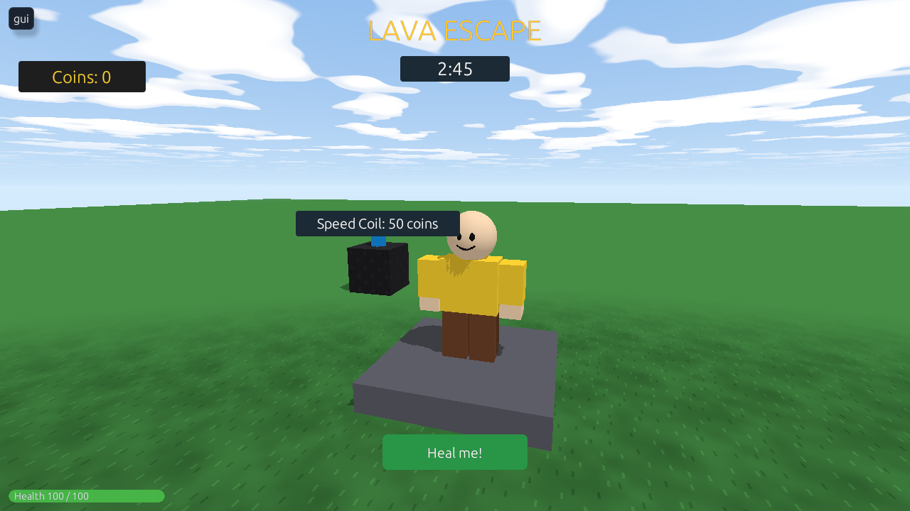

**GUI** (graphical user interface) is anything drawn **on the screen** instead of in the world: scores, timers, messages, buttons, health bars. Brixo has three kinds:

| Object | What it is |
|---|---|
| **TextLabel** | Text. Scores, titles, messages. |
| **TextButton** | Text players can **click**. Its script hears `on clicked(p)`. |
| **Frame** | A plain colored box. Backgrounds, bars, panels. |



## Who sees it

It depends on **where the GUI object is**:

- **In the Workspace** (or a folder): **everyone** sees it. A round timer, the game's title.
- **Inside a player**: **only that player** sees it. Their coins, a message for them.

Make shared ones in Studio with **Add GUI** (you can see and arrange them while building). Make per-player ones from a script with `create("TextLabel", p)`, usually when they join.

## Placing it

Positions and sizes are **fractions of the screen**, from 0 to 1, so your GUI fits any window:

- `x` and `y` are where its **top-left corner** goes: `x = 0` is the left edge, `x = 0.5` the middle, `y = 0` the top.
- `width` and `height`: `width = 0.2` is a fifth of the screen wide.

```rovik run with=textlabel:Title
title = find("Title")
title.text = "LAVA ESCAPE"
title.x = 0.35          -- 35% from the left
title.y = 0.02          -- near the top
title.width = 0.3
title.height = 0.08
title.text_size = 40
title.text_color = {r = 255, g = 200, b = 40}
```

To center something across the screen: `x = (1 - width) / 2`.

## Everything GUI has

| Property | What it does |
|---|---|
| `text` | The text shown (centered in the box). Numbers work too: `label.text = 42`. |
| `text_size` | How big the text is, in pixels (20 to start). |
| `text_color` | `{r, g, b}` |
| `background` | `true` draws a box behind the text. |
| `background_color` | `{r, g, b}` |
| `x`, `y`, `width`, `height` | Where it is and how big, as fractions of the screen. |
| `visible` | `false` hides it, **and everything inside it**. |
| `attached_to` | A part: the GUI floats above that part in the world, instead of sitting on the screen. |

Things are drawn in the order they are in the Explorer, so later ones go on top.

## Buttons

Put a script inside a TextButton and it hears **who clicked it**:

```rovik run in=textbutton:Heal_Button
self.text = "Heal me!"
self.x = 0.42
self.y = 0.85
self.width = 0.16
self.height = 0.07
self.background = true
self.background_color = {r = 40, g = 150, b = 70}

on clicked(p)
    p.health = p.max_health
    play_sound("pop", p)
end
```

A button lights up when the mouse is over it. A shared button (in the Workspace) can be clicked by everyone; each click tells you who.

## Per-player GUI

For something only one player should see, create it inside them:

```rovik run
on player_joined(p)
    hello = create("TextLabel", p)
    hello.text = "Welcome, " + p.name + "! Reach the top."
    hello.x = 0.25
    hello.y = 0.4
    hello.width = 0.5
    hello.height = 0.1
    hello.text_size = 30
    hello.background = true
    hello.background_color = {r = 13, g = 42, b = 74}
    hello.text_color = {r = 255, g = 255, b = 255}
    wait(4)
    destroy(hello)
end
```

## Labels over parts

Set `attached_to` to a part and the GUI floats **above it in the world**, moving with it: name tags, prices over shop items, "Press here" signs. `x` and `y` then nudge it from there (0 is right above the part).

```rovik run in=part:Shop_Pedestal
tag = create("TextLabel", find("Workspace"))
tag.text = "Speed Coil: 50 coins"
tag.attached_to = self
tag.x = 0
tag.y = 0
tag.width = 0.18
tag.height = 0.05
tag.background = true
```

## Bars

A health bar or a progress bar is two Frames: a dark one behind, and a colored one in front whose `width` you change:

```rovik run
on player_joined(p)
    back = create("Frame", p)
    back.x = 0.02
    back.y = 0.92
    back.width = 0.2
    back.height = 0.03
    back.background_color = {r = 30, g = 30, b = 30}
    bar = create("Frame", p)
    bar.name = "Health Bar"
    bar.x = 0.02
    bar.y = 0.92
    bar.height = 0.03
    bar.background_color = {r = 60, g = 200, b = 80}
    while true do
        bar.width = 0.2 * p.health / p.max_health
        wait(0.2)
    end
end
```

(Brixo Player already shows each player their own health at the bottom left. This is for your own bars: stamina, a boss's health, a capture meter.)

## Hiding and showing

`visible = false` hides a GUI object and everything inside it. So for a menu, put its labels and buttons **inside a Frame**, and show or hide the whole menu at once by changing the Frame's `visible`.

Next: [Tools and weapons](tools).
