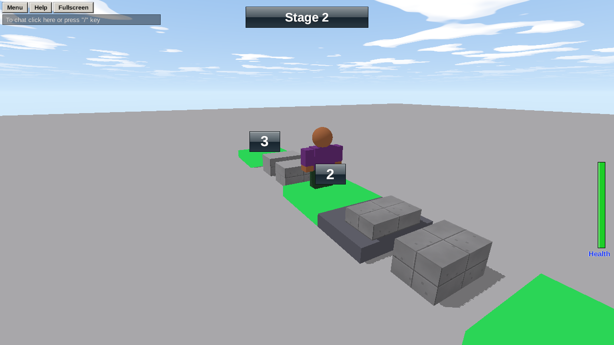

In a long obby, falling back to the very start gets old fast. **Checkpoints** remember how far each player got, and bring them back there.



## 1. The checkpoint pads

Make a flat pad (Size `6, 1, 6`, green, Neon) at the start of each section. Put this script in the first one:

```rovik run in=part:Checkpoint_1
stage = 1   -- change this in each copy: 2, 3, 4...

on touched(other)
    if other.class != "player" then
        return
    end
    if other.stage == nil or stage > other.stage then
        other.stage = stage
        other.checkpoint = self.name
        play_sound("win", other)
    end
end
```

Duplicate it for each checkpoint, **rename each copy** (Checkpoint 2, Checkpoint 3...) and change the `stage` number at the top of its script to match.

`stage > other.stage` means you only move **forward**: walking back over an old checkpoint doesn't move you back.

## 2. Coming back at the checkpoint

When a player respawns, `on respawned` runs. Move them to their checkpoint. Put this in a script in the **Workspace**:

```rovik run with=part:Checkpoint_1
on respawned(p)
    if p.checkpoint != nil then
        pad = find(p.checkpoint)
        p.position = {x = pad.position.x, y = pad.position.y + 4, z = pad.position.z}
    end
end
```

## 3. A stage counter

Everyone likes to see how far they've got. Add this to the same Workspace script:

```rovik run
on player_joined(p)
    p.stage = 0
    label = create("TextLabel", p)
    label.name = "Stage Label"
    label.x = 0.4
    label.y = 0.02
    label.width = 0.2
    label.height = 0.06
    label.text_size = 26
    label.background = true
end

every 0.5 seconds
    for p in players() do
        for c in p.children do
            if c.name == "Stage Label" then
                c.text = "Stage " + p.stage
            end
        end
    end
end
```

## 4. Skip-stage and reset buttons (optional)

Two TextButtons, each with its own script inside:

```rovik run in=textbutton:Reset_Button
self.text = "Back to start"
self.x = 0.85
self.y = 0.9
self.width = 0.13
self.height = 0.06

on clicked(p)
    p.stage = 0
    p.checkpoint = nil
    p.health = 0   -- knocked out: they respawn at the start
end
```

Setting a custom field to `nil` removes it, so after a reset `p.checkpoint` is empty again and they come back at the normal spawn.

## Remembering the stage next time

To let players carry on where they left off another day, [save](howto-saving) `p.stage` and `p.checkpoint` when they leave, and load them when they join.
