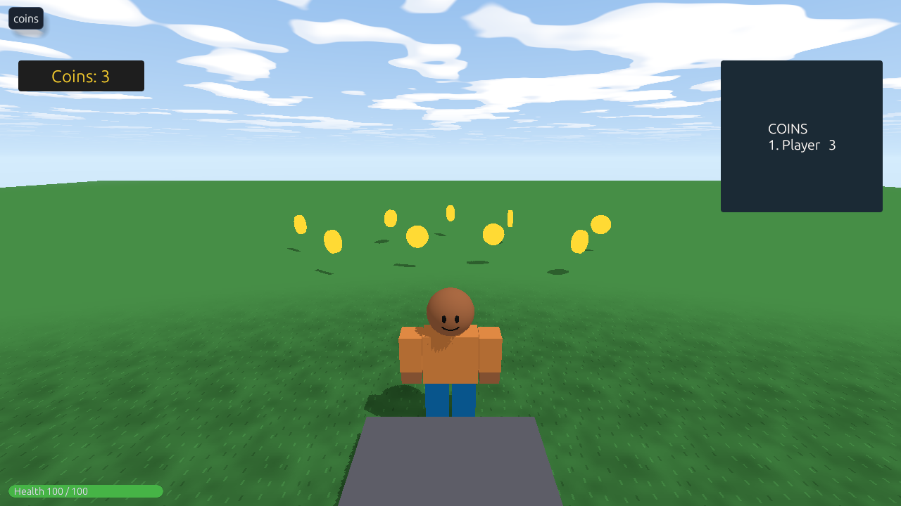

Coins to collect, a counter on each player's screen, and a leaderboard everyone can see.



## 1. The coin counter

One script, in the **Workspace**, gives each player coins and a label, and has a function that pays them. Call it **Coins**:

```rovik run
-- Coins: every player's coin count, and their label.
on player_joined(p)
    p.coins = 0
    label = create("TextLabel", p)
    label.name = "Coin Label"
    label.text = "Coins: 0"
    label.x = 0.02
    label.y = 0.12
    label.width = 0.14
    label.height = 0.06
    label.text_size = 24
    label.background = true
    label.background_color = {r = 30, g = 30, b = 30}
    label.text_color = {r = 245, g = 205, b = 48}
end
```

## 2. A coin

Make a small gold cylinder (Size `2, 0.4, 2`, turn it 90° on x so it stands on its edge, color it gold, Neon), turn **Can Collide** off so players pass through it, name it **Coin**, and give it this script:

```rovik run in=part:Coin
gone = false

on touched(other)
    if other.class == "player" and not gone and other.coins != nil then
        gone = true
        other.coins += 1
        for c in other.children do
            if c.name == "Coin Label" then
                c.text = "Coins: " + other.coins
            end
        end
        play_sound("coin", other)
        destroy(self)
    end
end

every 0.03 seconds
    self.rotation.y += 4
end
```

`gone` makes sure a coin is only collected once, even if two players touch it in the same instant.

Duplicate the coin (**Ctrl+D**) and spread copies around your map.

## 3. Coins that come back

Collected coins are gone for good. To keep the map full, keep the original in a **Storage** folder under the map and make new ones from it. Rename the original **Coin Template**, put it in a folder called **Storage**, and add this script in the Workspace:

```rovik run with=part:Coin_Template,folder:Storage
-- A new coin at a random spot every 2 seconds, up to 25 at a time.
coins_folder = create("Folder", find("Workspace"))
coins_folder.name = "Coins"

every 2 seconds
    if len(coins_folder.children) < 25 then
        coin = clone(find("Coin Template"))
        coin.name = "Coin"
        coin.position = {x = random(-50, 50), y = 3, z = random(-50, 50)}
        coin.parent = coins_folder
    end
end
```

## 4. A leaderboard

A shared TextLabel shows everyone's coins, the richest first. Add a TextLabel with **Add GUI**, name it **Leaderboard**, put it on the right (x `0.8`, y `0.12`, width `0.18`, height `0.3`), turn its background on, and add this script in the Workspace:

```rovik run with=textlabel:Leaderboard
-- Everyone who has coins, most first.
fn ranked()
    left = []
    for p in players() do
        if p.coins != nil then
            push(left, p)
        end
    end
    sorted = []
    while len(left) > 0 do
        best = 1
        for i in 1..len(left) do
            if left[i].coins > left[best].coins then
                best = i
            end
        end
        push(sorted, remove(left, best))
    end
    return sorted
end

every 1 seconds
    board = "COINS"
    place = 1
    for p in ranked() do
        board = board + "\n" + place + ". " + p.name + "   " + p.coins
        place += 1
    end
    find("Leaderboard").text = board
end
```

`ranked` sorts the players by picking the richest one left, again and again. `"\n"` starts a new line in the label.

## Spending coins

Coins are just a custom field, `p.coins`, so spending them is subtraction. See [A shop](howto-shop).

## Keeping coins between visits

Coins reset every time a player leaves. To keep them, [save them](howto-saving): load them in `on player_joined`, save them in `on player_left`.
