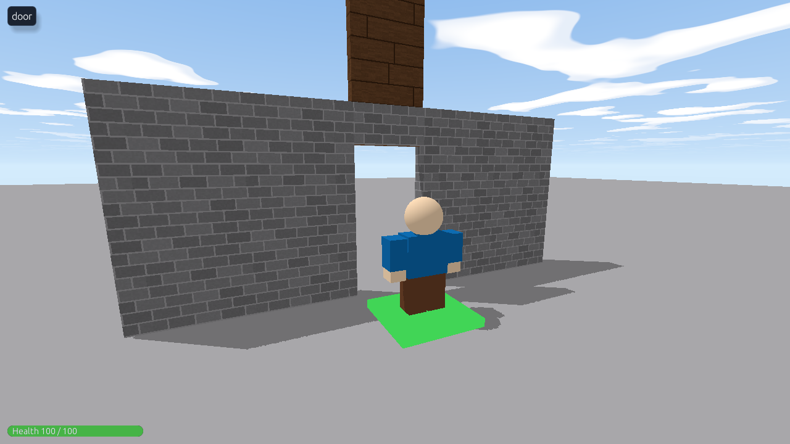

Doors that open when you step on a button, click a sign, or carry the right key.



## A pressure plate

Build a doorway, and a part in it called **Door**. In front of it, put a flat part called **Plate** (Size `4, 0.4, 4`). Put this script in the **Plate**:

```rovik run in=part:Plate with=part:Door
door = find("Door")
closed_y = door.position.y
busy = false

on touched(other)
    if other.class != "player" or busy then
        return
    end
    busy = true
    self.color = {r = 60, g = 200, b = 80}
    play_sound_at("click", self)
    -- Slide up, one step at a time.
    for i in 1..20 do
        door.position.y = closed_y + i * 0.4
        wait(0.03)
    end
    wait(3)
    -- And back down.
    for i in 1..20 do
        door.position.y = closed_y + (20 - i) * 0.4
        wait(0.03)
    end
    self.color = {r = 200, g = 60, b = 60}
    busy = false
end
```

`busy` stops the door starting to open again while it's already moving. `return` inside the handler just stops this one touch.

## A door you click

A **TextButton** can float over the door in the world, so anyone can click it. Add one in Studio (**Add GUI → TextButton**), name it **Door Button**, and put this script inside it:

```rovik run in=textbutton:Door_Button with=part:Door
door = find("Door")
self.attached_to = door      -- float over the door
self.text = "Open"
self.width = 0.08
self.height = 0.05

on clicked(p)
    if door.can_collide then
        door.transparency = 0.7
        door.can_collide = false
        self.text = "Close"
    else
        door.transparency = 0
        door.can_collide = true
        self.text = "Open"
    end
    play_sound("click")
end
```

The script has to be **inside the button** to hear `on clicked`, which is why the button is made in Studio rather than by a script.

## A locked door and a key

A key is any part the player touches to pick it up. It sets a custom field on them, and the door checks for it:

```rovik run in=part:Key
gone = false
on touched(other)
    if other.class == "player" and not gone then
        gone = true
        other.has_key = true
        play_sound("buy", other)
        destroy(self)
    end
end

every 0.03 seconds
    self.rotation.y += 3
end
```

```rovik run in=part:Locked_Door
on touched(other)
    if other.class == "player" then
        if other.has_key then
            self.can_collide = false
            self.transparency = 0.8
            play_sound("win")
        else
            play_sound("error", other)
        end
    end
end
```

`other.has_key` is `nil` for a player who never picked up the key, and `nil` counts as false in an `if`.
