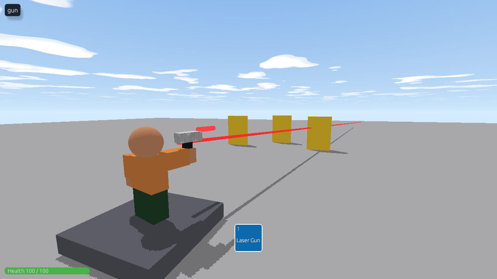

Two guns: a **laser** that hits instantly, drawing a glowing beam, and a **blaster** that fires balls of plasma you can see flying and dodge. Both aim where you click, respect teams, and credit knockouts.



## Build the gun

1. **Add Part → Tool.** Name the Tool **Laser Gun**.
2. The **Handle** is the grip: make it `0.35, 0.8, 0.45`.
3. Add a **Part** (a block) for the body above it (`0.5, 0.55, 1.6`, a little above and in front of the handle), and a **Cylinder** barrel in front (`0.3, 1.4, 0.3`, **Rotation** x `90` so it lies along +z). Drag them into the Tool in the Explorer.
4. Color it, and put it in your **Storage** folder. Give it to players as shown in [Tools and weapons](tools#giving-tools-to-players).

## The laser: instant hits

Put this script in the **Laser Gun**:

```rovik run in=tool:Laser_Gun
DAMAGE = 34
RANGE = 150
COOLDOWN = 0.6
ready_at = 0

-- An enemy of p: someone else, still up, and not on p's team.
fn enemy(p, other)
    return other != p and other.health > 0 and (p.team == nil or other.team != p.team)
end

-- The first enemy along the beam, and how far along it they are.
fn first_hit(p, from, dir, length)
    best = nil
    best_t = length
    for other in players() do
        if enemy(p, other) then
            -- How far along the beam is the point nearest to them?
            ox = other.position.x - from.x
            oy = other.position.y - from.y
            oz = other.position.z - from.z
            t = ox * dir.x + oy * dir.y + oz * dir.z
            if t > 0 and t < best_t then
                -- And how far is that point from them?
                cx = ox - dir.x * t
                cy = oy - dir.y * t
                cz = oz - dir.z * t
                if sqrt(cx * cx + cy * cy + cz * cz) < 2 then
                    best = other
                    best_t = t
                end
            end
        end
    end
    return {who = best, length = best_t}
end

-- A glowing beam from `from`, `length` long, that fades away.
fn draw_beam(from, dir, length)
    beam = create("Part", find("Workspace"))
    beam.name = "Laser Beam"
    beam.can_collide = false
    beam.material = "neon"
    beam.color = {r = 255, g = 40, b = 40}
    beam.size = {x = 0.2, y = 0.2, z = length}
    beam.position = {x = from.x + dir.x * length / 2, y = from.y + dir.y * length / 2, z = from.z + dir.z * length / 2}
    -- Turn it to point along dir (its length runs along its z).
    beam.rotation = {x = -asin(dir.y) * 57.2958, y = atan2(dir.x, dir.z) * 57.2958, z = 0}
    for i in 1..5 do
        wait(0.04)
        beam.transparency = i / 5
    end
    destroy(beam)
end

on activated(p)
    if time() < ready_at then
        return
    end
    ready_at = time() + COOLDOWN

    -- From the gun, toward where they clicked.
    f = p.look
    from = {x = p.position.x + f.x * 2, y = p.position.y + 1.5, z = p.position.z + f.z * 2}
    t = p.mouse
    dx = t.x - from.x
    dy = t.y - from.y
    dz = t.z - from.z
    d = max(sqrt(dx * dx + dy * dy + dz * dz), 0.01)
    dir = {x = dx / d, y = dy / d, z = dz / d}

    -- The beam keeps going past the click, out to RANGE: a click on
    -- someone's front lands a little short of their middle.
    hit = first_hit(p, from, dir, RANGE)
    if hit.who != nil then
        hit.who.health -= DAMAGE
        hit.who.last_hit_by = p.name
        play_sound_at("hit", hit.who)
    end
    play_sound_at("pop", p)
    draw_beam(from, dir, hit.length)
end
```

How it works:

1. **Aim:** `p.mouse` is where they clicked. Subtracting the gun's position gives a direction; dividing by its length `d` makes it 1 stud long (`dir`), so "`dir` times 10" is exactly 10 studs along the shot.
2. **Hit test:** for each enemy, `t` is how far along the beam the point closest to them is, and `cx, cy, cz` is how far they are from that point. Within 2 studs of the beam counts as a hit. The nearest one wins. The beam doesn't stop at the click: it carries on to `RANGE`, so clicking the front of someone (a little closer than their middle) still hits them.
3. **The beam:** a thin neon part, as long as the shot, placed at its middle and turned to point along it, fading out in a fifth of a second.

## The blaster: real projectiles

A projectile needs its **own script**, to notice what it hits. So build one plasma ball, keep it in Storage, and clone it for each shot.

**The plasma ball:** a **Ball** part (Size `0.8, 0.8, 0.8`, Neon, bright blue, **Can Collide** off), named **Plasma Ball**, in the **Storage** folder, with this script:

```rovik run in=part:Plasma_Ball with=folder:Storage
-- The template in Storage waits to be copied: don't run there.
if self.parent.name == "Storage" then
    return
end

gone = false
fn pop()
    if not gone then
        gone = true
        destroy(self)
    end
end

on touched(other)
    if gone then
        return
    end
    -- Brushing the shooter's own gun on the way out doesn't count.
    if other.parent != nil and other.parent.class == "tool" then
        return
    end
    if other.class == "player" then
        if other.name == self.owner then
            return
        end
        shooter = find(self.owner)
        if shooter != nil and other.health > 0 and (shooter.team == nil or other.team != shooter.team) then
            other.health -= 20
            other.last_hit_by = self.owner
            play_sound_at("hit", other)
        end
    end
    pop()
end

wait(3)
pop()   -- gone after 3 seconds if it didn't hit anything
```

**The gun's script** (in a Tool called **Blaster**):

```rovik run in=tool:Blaster with=part:Plasma_Ball
ready_at = 0

on activated(p)
    if time() < ready_at then
        return
    end
    ready_at = time() + 0.35

    f = p.look
    from = {x = p.position.x + f.x * 3, y = p.position.y + 1.5, z = p.position.z + f.z * 3}
    t = p.mouse
    dx = t.x - from.x
    dy = t.y - from.y
    dz = t.z - from.z
    d = max(sqrt(dx * dx + dy * dy + dz * dz), 0.01)

    ball = clone(find("Plasma Ball"))
    ball.name = "Plasma"
    ball.owner = p.name            -- so its script knows who fired it
    ball.position = from
    ball.floating = true           -- no gravity: flies straight
    ball.anchored = false
    ball.velocity = {x = dx / d * 90, y = dy / d * 90, z = dz / d * 90}
    ball.parent = find("Workspace")
    play_sound_at("twang", p)
end
```

`ball.owner = p.name` is a custom field on the ball: that's how the ball's own script knows who fired it (to skip them, and to credit the knockout).

## Ideas

- **A rocket launcher:** in the ball's script, replace the damage with `explode(self.position, 8)`. Explosions knock out everyone in range and blow breakable walls apart. (Set `hit = explode(...)` and put `last_hit_by` on everyone in `hit`, to credit the knockouts.)
- **Ammo:** keep `ammo = 12` in the gun's script, take one per shot, and stop at 0. Refill it with a pickup, or after a reload `wait`.
- **Show the ammo:** make a TextLabel inside the player when they get the gun, and update it each shot.
- **A shotgun:** fire three balls at once, each with its direction nudged a little: add `random(-10, 10) / 100` to `dx / d` and `dz / d`.
