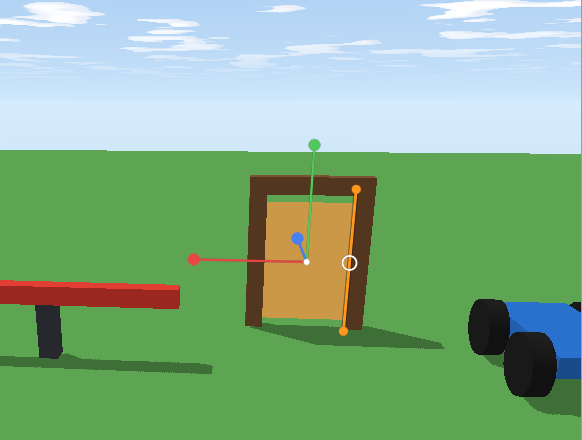

A **hinge** lets a part turn around one of its own lines, like a door on its hinges or a wheel on its axle. Add a **motor** and it turns by itself. Doors, wheels, spinners, drawbridges and swinging signs are all hinges.



## Hinges in Properties

Select a part and, in **Properties**, pick what it **Hinge** turns around:

| Hinge | Turns around | For |
|---|---|---|
| **Its height (Y)** | an upright line | doors, spinners, and wheels (a cylinder's height is its axle) |
| **Its width (X)** | a side-to-side line | drawbridges, trapdoors, swinging signs |
| **Its depth (Z)** | a front-to-back line | a windmill's sails, a clock hand |

**Hinge at** says *where* the line is: the part's **middle**, or the middle of one of its sides. A door hinges at its **left** (or right) side; a wheel at its middle.

Studio draws the hinge as an **orange line** on the selected part, so you can see it's where you meant.

A hinged part has to be **loose** to turn, so turning a hinge on unticks **Anchored** for you. What it hangs on is found when the game starts: **whatever it's touching nearest the hinge**. Put a door against its door frame, a wheel against its car. If it touches nothing, it hangs where it is, in the air.

## A door that swings

Build a door frame (anchored), and inside it a part called **Door**: Size `5, 7, 0.4`, touching the frame's left post. Set **Hinge** to *Its height (Y)* and **Hinge at** to *Left side*. Press Play and walk into it: it swings open, and slowly settles.

To open it by itself, use **Swing to**: the angle it turns to, and holds. A script can open it when someone's near:

```rovik run in=part:Door
self.hinge = "y"
self.hinge_at = "left"
open_at = 0

on touched(other)
    if other.class == "player" then
        -- Swing away from them, or the door would bump into them.
        if other.position.z < self.position.z then
            self.swing_to = -100
        else
            self.swing_to = 100
        end
        open_at = time()
    end
end

-- Close again 3 seconds after the last touch.
every 0.5 seconds
    if self.swing_to != nil and time() - open_at > 3 then
        self.swing_to = 0
    end
end
```

Angles are in degrees, from where the part started: `90` is a quarter turn one way, `-90` the other way. This door faces along z (it's wide in x), so it checks which side of it (in z) the player is, and swings the other way. A door turned sideways would compare `x` instead. `self.swing_to = nil` lets it swing freely again. `self.hinge_angle` tells you how far it's turned right now.

## A spinner

A long bar spinning on a post, knocking players off, is an obby favourite. Make an anchored **post**, and a long bar resting on top of it (Size `14, 1, 1`). Give the bar **Hinge** *Its height (Y)*, **Hinge at** *Bottom*, and a **Motor speed** of `120` (degrees a second). That's it: no script.

Scripts can change the speed, or reverse it:

```rovik run in=part:Spinner
self.hinge = "y"
self.hinge_at = "bottom"
self.motor_speed = 120

every 5 seconds
    self.motor_speed = -self.motor_speed
end
```

## A car

1. Make the **body**: a loose part, Size `4, 1, 8`.
2. Make a **wheel**: a *Cylinder*, Size `3, 1, 3`, turned `90` on z so it stands on its edge. Place it against the side of the body. Set **Hinge** to *Its height (Y)* (a cylinder's height is its axle), **Hinge at** *Middle*.
3. Copy it three times for the other wheels.
4. Select everything and group it into a **Model** (Ctrl+G), with the **body first** in the Explorer.

Give every wheel the same **Motor speed** and the car drives. All four wheels turn around the same line, so the same speed makes them all roll the same way (opposite speeds on the two sides spin the car on the spot, like a tank).

To drive it, add a **seat**: players sit in it and its `throttle` and `steer` say what they press, for a script to turn into wheel speeds. See [Vehicles and seats](howto-vehicles).

## Things to know

- A **Model** normally welds its parts together. Its hinged parts are left free to turn; the rest stay welded.
- Hinge a Model's **first** part and the **whole Model** swings with it: a door built from several parts (a panel and a handle) only needs its first part hinged.
- An **anchored** part doesn't turn, even with a hinge. Untick Anchored.
- Hinged parts don't bump into what they hang on, so a wheel can sit right against its car.
