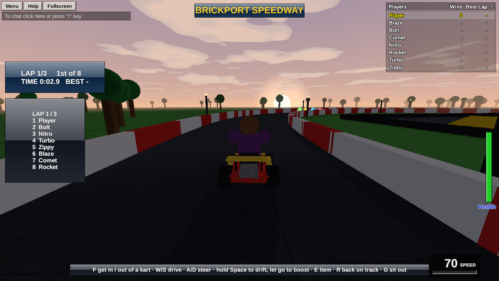

**Karts** are little cars players drive: arcade handling, drifting with boosts, jumps off ramps, and bumping into each other. Put a player in one, and their keys drive it. Add **bots** and they race too. The kart racing sample game, **Brickport Speedway**, is built from everything on this page.



## Driving

In a kart, the keys change:

| Keys | In a kart |
|---|---|
| **W** / **S** | Accelerate / brake, then reverse |
| **A** / **D** (or ← →) | Steer |
| **Space** | Hold while turning to **drift**: a hop, then a slide. Sparks show the drift charging, white, then blue, then orange. Let go for a **boost**: a short one after blue sparks, a big one after orange. |

The camera swings in behind the kart and pulls back as it speeds up. Driving off a ramp throws the kart into the air.

## Making a kart

A kart is a **Model** with the custom field **`kart = true`** (in Properties, or `model.kart = true` from a script). Build it facing **+Z** (forwards is the way a part's **front** faces), then name its parts:

| Part name | What it is |
|---|---|
| **Chassis** | The body. Brixo drives this part and everything else rides along with it. (With no Chassis, it's the first part.) |
| **Seat** | Where the driver sits. |
| **Wheel...** (Wheel L, Wheel R) | Back wheels: they turn as the kart rolls. Make them cylinders on their edge. |
| **Front Wheel...** | Front wheels: they roll and steer. |

Anything else (a spoiler, an engine, bumpers) just rides along. The kart bumps into things with a box around all of its parts, so keep it compact: about 4 studs wide and 6 long is a good size.

## Getting in and out

A player drives a kart when their **`kart`** is set to it. A pad next to the kart that puts whoever steps on it into the driving seat:

```rovik run in=part:Kart_Pad
on touched(other)
    kart = find("Red Kart")
    if other.class == "player" and other.kart == nil and kart != nil and kart.driver == nil then
        other.kart = kart
    end
end
```

`kart.driver` is whoever's driving it (`nil` if nobody). Setting `p.kart = nil` puts them out, beside the kart. Only one player drives a kart at a time; giving it to a second player is an error.

## What a kart tells you

Karts keep custom fields up to date, for scripts to read:

| Field | |
|---|---|
| `speed` | How fast it's going, in studs a second. |
| `drift` | `0` not drifting, `0.5` drifting, `1` charged for a small boost, `2` for a big one. |
| `boosting` | `true` while a boost lasts. |
| `spinning` | `true` while it's spinning out. |

And fields you set to change how it drives:

| Field | |
|---|---|
| `top_speed` | Its fastest, normally 70. A boost goes 40% faster. Slow it in mud; speed it up for a power-up. |
| `locked = true` | It won't move: for the countdown before a race. Set it back to `nil` to go. |

## Boosts, spin-outs and teleports

| Function | What it does |
|---|---|
| `boost(kart, seconds)` | A burst of speed. |
| `spin_out(kart)` | It spins round and stops for a second, dropping any boost. |
| `place_kart(kart, position, facing)` | Moves it there, stopped, facing that way (degrees: `0` is +Z, `90` is +X). |

A **boost pad**:

```rovik run in=part:Boost_Pad
self.can_collide = false
self.color = {r = 255, g = 150, b = 30}
self.material = "neon"

on touched(other)
    if other.class == "player" and other.kart != nil then
        boost(other.kart, 1.2)
        play_sound("whoosh", other)
    end
end
```

When a kart touches something, so does its driver, so `on touched` hears the **player** (and their `kart` says which kart).

## Keys for your game

Scripts can use these keys: **E Q F R G Z X C V B**. When a player presses one, `on key` runs, with who pressed it and which key. They work driving or on foot.

```rovik run
on key(p, k)
    if p.kart == nil then
        return
    end
    if k == "e" then
        boost(p.kart, 1)
    elseif k == "r" then
        -- Back on the track, if they've gone off it.
        place_kart(p.kart, {x = 0, y = 3, z = 0}, 90)
    end
end
```

Tell players which keys do what, with a [label](gui) on the screen.

## Bots

`add_bot(name)` adds a computer player. Bots are players like any other (they're in `players()`, and `on player_joined` hears them), with `bot` set to `true`. Put a bot in a kart and it drives itself, around the **racing line**:

1. Make a **Folder** of small parts along the middle of your track, named `1`, `2`, `3` and so on, in the order they're driven. Make them invisible (`transparency` 1) and not solid. A point every 10 studs or so is plenty.
2. Set the Workspace's `racing_line` to the folder's name.

```rovik run with=folder:Racing_Line
find("Workspace").racing_line = "Racing Line"
bot = add_bot("Bolt")
bot.lane = 3
bot.kart = find("Blue Kart")
```

(`find` gives `nil` when there's no Blue Kart, which puts nobody in a kart.) Bots slow down for bends, steer round karts in their way, and back up when they're stuck. `lane` keeps a bot that many studs to the left of the line (negative for the right), so a pack of bots spreads out. Give bots different `top_speed`s so some are faster than others, or change them during the race to keep it close.

## A flyover before the race

Set a player's `camera_part` to a part and their camera sits on it, looking the way the part's front faces; move the part and the camera glides after it. Make the part invisible and not solid. `camera_part = nil` gives them their camera back.

```rovik run with=part:Camera_Part
cam = find("Camera Part")
cam.transparency = 1
cam.can_collide = false

fn flyover(p)
    p.camera_part = cam
    for i in 0..100 do
        cam.position = {x = -60 + i * 1.2, y = 25, z = 40}
        cam.rotation = {x = 20, y = 180, z = 0}
        wait(0.03)
    end
    p.camera_part = nil
end

on player_joined(p)
    flyover(p)
end
```

`rotation.y` turns it (`180` looks towards -Z) and `rotation.x` tips it down.

## Laps and places

Brixo leaves the rules of a race to your scripts. The usual way: **checkpoints** around the track, in order, that each kart must pass in turn; a lap is passing them all. Brickport Speedway's **Race** script does it all, and it's worth reading: the lobby, the grid, the start lights, laps and places, items, bots that catch up when they fall behind, the podium and fireworks, and saving wins and best laps. See [The sample games, explained](samples#brickport-speedway).
