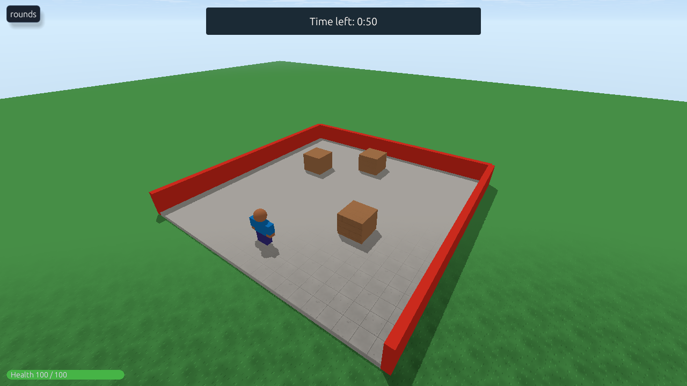

Most games run in **rounds**: wait in the lobby, get sent into the arena, play until time runs out, see who won, and go again. Here's the whole loop.



## Set up

- Your **SpawnLocation** is in the **lobby**, where players wait.
- A part called **Arena**, somewhere in the arena, marks where players get sent. (It can be invisible: Transparency 1, Can Collide off.)
- A shared **TextLabel** called **Status** across the top of the screen (Add GUI → TextLabel: x `0.3`, y `0.02`, width `0.4`, height `0.07`, background on).

## The round loop

One script in the **Workspace** runs everything:

```rovik run with=textlabel:Status,part:Arena
status = find("Status")
arena = find("Arena")
LOBBY_SECONDS = 15
ROUND_SECONDS = 60

fn say(text)
    status.text = text
end

fn send_to_arena(p)
    -- Spread out around the arena marker.
    p.position = {x = arena.position.x + random(-8, 8), y = arena.position.y + 4, z = arena.position.z + random(-8, 8)}
end

fn send_to_lobby(p)
    lobby = find("SpawnLocation")
    p.position = {x = lobby.position.x + random(-3, 3), y = lobby.position.y + 4, z = lobby.position.z + random(-3, 3)}
end

while true do
    -- Lobby: count down, and wait for enough players.
    for left in 0..LOBBY_SECONDS - 1 do
        say("Next round in " + (LOBBY_SECONDS - left))
        wait(1)
    end
    if len(players()) < 1 then
        say("Waiting for players...")
        wait(2)
        continue
    end

    -- The round.
    play_music("rush")
    for p in players() do
        p.in_round = true
        send_to_arena(p)
    end
    round_start = time()
    while time() - round_start < ROUND_SECONDS do
        left = floor(ROUND_SECONDS - (time() - round_start))
        say("Time left: " + floor(left / 60) + ":" + (left % 60 < 10 and "0" or "") + left % 60)
        wait(0.5)
    end

    -- Round over.
    stop_music()
    play_sound("win")
    survivors = []
    for p in players() do
        if p.in_round then
            push(survivors, p.name)
        end
        p.in_round = false
        send_to_lobby(p)
    end
    if len(survivors) == 0 then
        say("Nobody survived!")
    else
        say("Survivors: " + len(survivors))
    end
    wait(5)
end
```

A few things worth noticing:

- The whole game is one `while true do` loop, with `wait`s so it never freezes anything.
- `continue` skips back to the top of the loop, to count down again, when nobody's playing yet.
- `(left % 60 < 10 and "0" or "")` adds a leading zero, so the clock shows `1:05` rather than `1:5`.
- `p.in_round` is a custom field marking who's playing this round.

## Knocked out? You're out

In a survival round, a knocked-out player shouldn't come back into the arena. Clear their flag when they're knocked out, and they'll respawn in the lobby (at the SpawnLocation) and sit the rest of the round out:

```rovik run
on died(p)
    p.in_round = false
end
```

## Joining in the middle

Someone who joins during a round waits in the lobby until the next one, because they're not in `players()` when the round starts sending people. Tell them so:

```rovik run
on player_joined(p)
    p.in_round = false
    note = create("TextLabel", p)
    note.text = "A round is on. You'll join the next one!"
    note.x = 0.3
    note.y = 0.12
    note.width = 0.4
    note.height = 0.05
    wait(5)
    destroy(note)
end
```

From here, every kind of round game is the same loop with different rules in the middle: last one standing, most coins in 60 seconds, first team to 10 knockouts. For teams, see [A team game](howto-teams).
