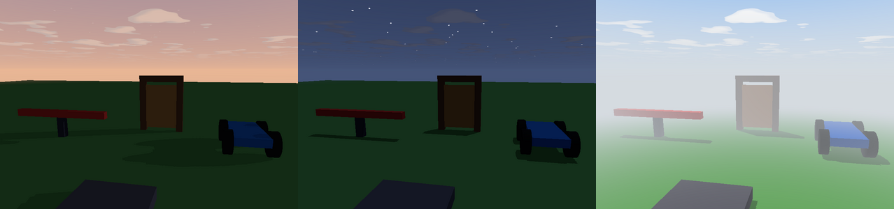

Brixo's sky is sunny and blue at 2 in the afternoon. **Lighting** changes that: the time of day, how bright it is, fog, and the color of the sky.



## In Studio

Select the **Workspace** at the top of the Explorer. Its Properties have a **Lighting** section:

- **Time of day**: slide it. The sun rises at 6:00 am, is overhead at noon, and sets at 6:00 pm, turning the sky orange; after that it's night, with stars and a dim blue moon.
- **Brightness**: 1 is normal. Lower is gloomier, higher is dazzling.
- **Sky color**: tick it to pick the sky's color overhead (a green alien sky, a red one...).
- **Fog**: tick it, pick its color, and say where it **starts** and where things are **gone by**, in studs from the camera.

What you set is saved with the game and everyone sees it.

## From scripts

The same settings are on the Workspace for scripts:

| Field | | |
|---|---|---|
| `time_of_day` | 0 to 24 | Hours. 14 unless you change it. |
| `brightness` | 0 to 3 | 1 is normal. |
| `fog_start`, `fog_end` | studs | Fog fades things from `fog_start` until they're gone at `fog_end`. `fog_end = 0` is no fog. |
| `fog_color` | color | |
| `sky_color` | color or `nil` | The sky overhead; `nil` for the usual. |

A day that goes round every 4 minutes:

```rovik run
world = find("Workspace")

every 0.5 seconds
    world.time_of_day = (world.time_of_day + 0.05) % 24
end
```

`% 24` wraps round to 0 after midnight.

A spooky fog that rolls in when a round starts:

```rovik run
world = find("Workspace")
world.fog_color = {r = 90, g = 100, b = 90}
world.time_of_day = 20

for step in 1..20 do
    world.fog_end = 400 - step * 17
    world.fog_start = world.fog_end / 4
    wait(0.25)
end
```

Setting any of them to `nil` puts it back how it was.
