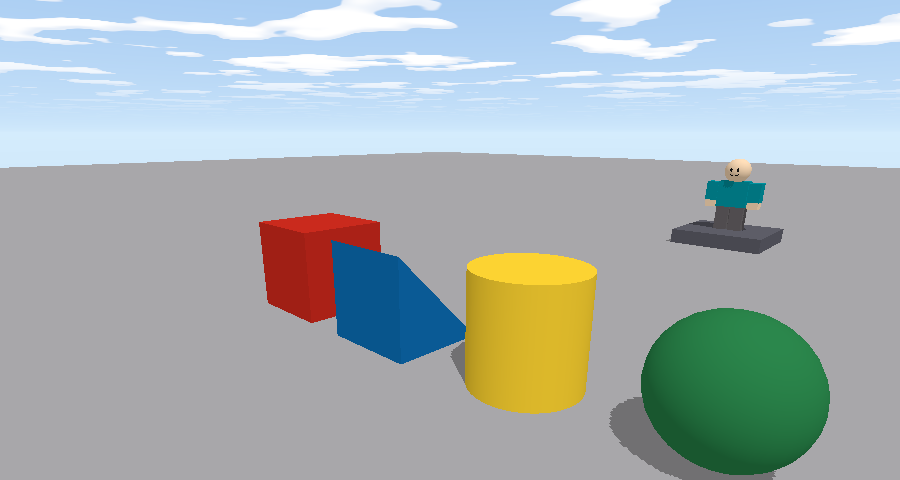
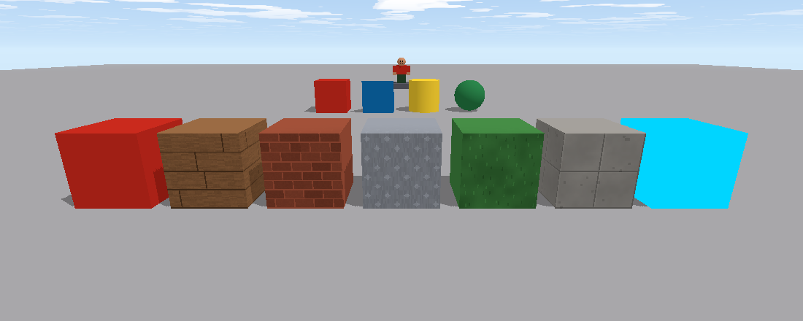

**Parts** are the bricks everything is built from. You can build them by hand in Studio, and scripts can change any part while the game runs: move it, color it, make it fall, spin it, hide it.

## Sizes and positions

Brixo measures in **studs**. A player is about 5 studs tall and 4 wide, and walks 16 studs a second.

- **`position`** is where the part's **center** is: `x` is left-right, `y` is **up**, `z` is forward-back.
- **`size`** is how big it is along each of those.
- **`rotation`** is how it's turned, in **degrees** around each axis. Turning around `y` spins it like a record.

```rovik run in=part:Platform
self.position = {x = 0, y = 12, z = 30}   -- put it here
self.size = {x = 8, y = 1, z = 8}         -- 8 by 8, and 1 thick
self.rotation = {x = 0, y = 45, z = 0}    -- turned 45 degrees
```

You can change just one direction: `self.position.y += 3` lifts it 3 studs and leaves `x` and `z` alone. You can also copy another part's position: `self.position = find("Marker").position`.

## Everything a part has

| Property | Values | What it does |
|---|---|---|
| `name` | text | Its name. Scripts find things by name. |
| `position` | `{x, y, z}` | Where its center is. |
| `size` | `{x, y, z}` | How big it is. |
| `rotation` | `{x, y, z}` degrees | How it's turned. |
| `color` | `{r, g, b}`, each 0 to 255 | Its color. |
| `material` | `"plastic"`, `"wood"`, `"brick"`, `"metal"`, `"grass"`, `"concrete"`, `"neon"` | What its surface looks like. Neon glows. |
| `shape` | `"block"`, `"wedge"`, `"cylinder"`, `"ball"` | Its shape. |
| `transparency` | 0 to 1 | 0 is solid, 1 is invisible, 0.5 is half see-through. |
| `anchored` | true / false | **true**: stays exactly where it is. **false**: falls and gets pushed around. |
| `can_collide` | true / false | **false**: things pass through it. It still fires `on touched`. |
| `velocity` | `{x, y, z}` studs/second | How fast it's moving. On an anchored part, it's a **conveyor**: it carries things on top along. |
| `floating` | true / false | A loose part with no gravity: it flies straight (a rocket). |
| `bounce` | 0 to 1 | How bouncy it is. 1 bounces back almost as high as it fell. |
| `parent`, `children`, `class` | | What it's in, what's in it, and `"part"`. See [Models, folders and templates](models-folders). |

## Shapes and materials



A **block** is what Studio calls a plain **Part** (in the Add Part menu and the Shape box); in scripts it's `"block"`. A **wedge** is a ramp: it rises toward its back (its +z side). A **cylinder** stands up along its height (its `size.y`), so to make a log lying on its side, turn it 90 degrees on `x` or `z`.



Materials are drawn with Brixo's pixel-art textures, tinted by the part's color, so a brick part colored grey makes a stone wall and colored red makes a red-brick house.

## Colors

Colors are `{r = ..., g = ..., b = ...}`: how much **red**, **green** and **blue**, each from 0 to 255.

```rovik run in=part:Light
self.color = {r = 255, g = 0, b = 0}       -- red
wait(0.5)
self.color = {r = 255, g = 255, b = 255}   -- white
wait(0.5)
self.color = {r = random(0, 255), g = random(0, 255), b = random(0, 255)}   -- anything!
self.material = "neon"                     -- and make it glow
```

A few to start from: black `0, 0, 0` · white `255, 255, 255` · Brixo red `196, 40, 28` · blue `13, 105, 172` · green `75, 151, 75` · yellow `245, 205, 48` · orange `218, 133, 65` · purple `107, 50, 124` · grey `163, 162, 165`.

## Anchored or loose

When you build in Studio, parts are **anchored**: they stay exactly where you put them, even in mid-air. Turn **Anchored** off and a part is **loose**: when the game runs, it falls, tumbles, and can be pushed and knocked over.

```rovik run in=part:Crate
-- Drop the crate after 2 seconds.
wait(2)
self.anchored = false
```

Loose parts that fall off the bottom of the world (below y = -60) are removed, so they don't pile up out of sight forever.

## Moving parts with scripts

Setting `position` moves a part instantly. Do it a little at a time and it glides:

```rovik run in=part:Elevator
-- Rise 10 studs over 2 seconds, then come back down.
while true do
    for i in 1..40 do
        self.position.y += 0.25
        wait(0.05)
    end
    wait(1)
    for i in 1..40 do
        self.position.y -= 0.25
        wait(0.05)
    end
    wait(1)
end
```

Players standing on a moving part ride along with it. There's a complete version of this in [Moving platforms](howto-moving-platform).

Spinning is the same idea with `rotation`:

```rovik run in=part:Spinner
every 0.03 seconds
    self.rotation.y += 3
end
```

## Conveyors

Give an **anchored** part a `velocity` and it stays still, but carries anything on top of it along, like a conveyor belt or a moving walkway:

```rovik run in=part:Belt
self.velocity = {x = 0, y = 0, z = 12}   -- carry things toward +z at 12 studs a second
```

On a **loose** part, `velocity` is its actual speed: set it to throw the part.

```rovik run in=part:Ball
self.shape = "ball"
self.anchored = false
self.bounce = 0.8
self.velocity = {x = 0, y = 40, z = 20}   -- up and away
```

## Making and removing parts

`create("Part", parent)` makes a new part inside `parent`. It starts as a 1-stud grey anchored block at the center of the world, so set what you need:

```rovik run
-- Rain 20 colored balls from the sky.
for i in 1..20 do
    ball = create("Part", find("Workspace"))
    ball.name = "Rain Ball"
    ball.shape = "ball"
    ball.size = {x = 2, y = 2, z = 2}
    ball.color = {r = random(50, 255), g = random(50, 255), b = random(50, 255)}
    ball.position = {x = random(-30, 30), y = 40, z = random(-30, 30)}
    ball.anchored = false
    wait(0.2)
end
```

`destroy(part)` removes a part (and everything inside it) for good. `clone(part)` makes a copy, with everything inside it, scripts included. Copying things you've built is usually easier than creating them from scratch: see [Models, folders and templates](models-folders).

Next: [Models, folders and templates](models-folders).
