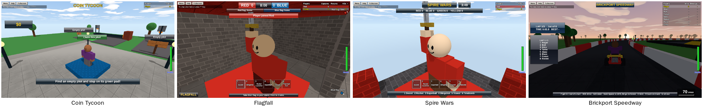

Brixo's sample games are on the [Games](/games) page. They're also the best way to learn how bigger games fit together, because you can **open them in Studio** and read every script:

1. In Studio, pick **File > Open a sample game**. Or download one below and **drag the file onto the Studio window** (or open it with **File > Open**).
2. It opens as a new game. Studio asks first if you have unsaved changes.
3. Click through the Explorer, read the scripts, press Play, and change things to see what happens.



| Game | Download |
|---|---|
| **Coin Tycoon** | [coin-tycoon.brixo](samples/coin-tycoon.brixo) |
| **Flagfall** | [flagfall.brixo](samples/flagfall.brixo) |
| **Spire Wars** | [spire-wars.brixo](samples/spire-wars.brixo) |
| **Brickport Speedway** | [brickport-speedway.brixo](samples/brickport-speedway.brixo) |
| **Gear Range** (a test map with the whole gear kit) | [gear-range.brixo](samples/gear-range.brixo) |

## Coin Tycoon

**The game:** step on a green pad to claim a plot. Droppers make ore, a conveyor carries it into a furnace, and the furnace turns it into cash. Spend the cash on red pads that build more of your tycoon: faster droppers, gold ore, an upgrader that doubles ore's value, and finally a tower.

**How it's built:**

- **Each plot is a Model** with everything inside it: the claim pad, the sign, the buy pads, the droppers, the belt and the furnace. The plots are copies of each other, and every script finds its own plot with `self.parent`, so they all work without knowing which plot they're in.
- **Claiming** writes the player's name on the plot, `plot.owner = other.name`, and the plot's name on the player, `other.plot = plot.name`. Every other script checks `plot.owner` to know whose plot it is.
- **Buy pads** have custom fields: a `price`, the `item` they build, and the `next` pad to show. One script works for every pad:

```rovik sketch
on touched(other)
    plot = self.parent.parent
    if other.class != "player" or self.transparency > 0.5 or plot.owner != other.name then
        return
    end
    if other.cash < self.price then
        play_sound("error", other)
        return
    end
    other.cash -= self.price
    ...
end
```

- **Ore carries its value with it**, as a custom field. The furnace pays whatever the ore says it's worth, and the upgrader doubles it:

```rovik
-- The furnace.
on touched(other)
    if other.name == "Ore" then
        owner = find(self.parent.parent.owner)
        if owner != nil and other.value != nil then
            owner.cash += other.value
        end
        destroy(other)
    end
end
```

Things built but not bought yet are see-through and pass-through, and fade in when you buy them.

## Flagfall

**The game:** capture the flag, Red against Blue, across a river. Grab the enemy flag and carry it to your own flag stand, but you can only score while **your** flag is safe at home. First to 3 captures wins. There are three ways across: the bridge, the ruins and a tunnel under the river.

**How it's built:**

- **One Game script runs the rules**, with the state of each flag in maps: `flag_state = {Red = "home", Blue = "home"}` and who's carrying it.
- **Carrying a flag** is the `carried_by` custom field: set it to the carrier's name and the flag rides on their back. When the carrier is knocked out, `on died` drops the flag where they fell. If nobody picks it up within 10 seconds, it goes home.
- **Beacons** (`beacon = true`) mark the flags, so you can always see where they are, through walls.
- **Teams and spawns** work exactly like [A team game](howto-teams).
- The ruins are **breakable** bricks, and they're rebuilt for each match from a hidden copy under the map.
- The music switches to a faster version while a flag is out.

## Spire Wars

**The game:** four teams, four towers of breakable bricks, and the whole gear kit: sword, rocket launcher, superball, slingshot, trowel and timebomb. Knock out other teams' players to score. Rockets and bombs blow bricks out of towers, and towers with their base knocked out come down. When the round ends, the map is rebuilt and the next round starts.

**How it's built:**

- **Four teams**, each new player joining the smallest one, with team shirts and team spawns on top of their tower. If a tower's gone, its team respawns where it stood.
- **Every tower brick is `breakable`**, so explosions knock bricks loose, and bricks cut off from the ground fall.
- **Rounds** use the same idea as [Timed rounds](howto-rounds): an `every 0.5 seconds` block runs the clock and the scoreboard, and at 0 it announces the winner and rebuilds.
- **Rebuilding:** the whole map sits in a hidden copy, **Map Template**, 500 studs under the ground. To rebuild, the game destroys what's left of the map and clones the template back up:

```rovik
fn rebuild()
    for c in find("Map").children do
        destroy(c)
    end
    for c in find("Map Template").children do
        copy = clone(c)
        drop_in(copy)          -- moves every part in it up 500 studs
        copy.parent = find("Map")
    end
end
```

## Brickport Speedway

**The game:** kart racing for up to 8, with bots filling the empty places. Between races you're on foot in the pits: walk up to any kart and press **F** to drive it round the track, or go to the **Drift Park** in the infield (cones, a drift circle, a jump), which stays open even during a race. Everyone's in the next race unless they click **Next race: sitting out** (or press **G**). A race starts with a flyover of the track to its own music, a moment's quiet on the grid, five red lights, and **GO** into the racing music. Three laps of a figure-8: a banked sweeper, over a bridge the track later runs under, a jump across the canyon, a town street, a hairpin, and a shortcut through a barn (narrow, and slow going). Drive through **item boxes** for a boost, a homing rocket, a spike mine or a shield, and use it with **E**; **R** puts you back on the track. The last lap gets its own louder music. The top three go up on the podium, with fireworks. Your wins and best lap are saved, and each race is at a different time of day: sunset, night, afternoon.

**How it's built:**

- **The track is made in code** from 31 points along its middle, smoothed into a curve: road pieces follow it, tilting uphill, downhill and into the bends, with red and white walls either side. Open the file to see the result; the pieces are all ordinary parts.
- **The karts** are Models with `kart = true`, parked on the grid. See [Karts, racing and bots](howto-karts).
- **One Race script runs everything**, with each racer's progress in a map, `racers[name]`: how many checkpoints they've passed, which one is next, their lap times. It loops for ever: lobby, flyover, lights, race, results. The lobby's length is the Workspace's `lobby_seconds` (45 if it isn't set).
- **The flyover** moves one invisible part, **Flyover Camera**, through the shots in the **Flyover** folder (each a From and a To part), with everyone's `camera_part` set to it. Music is made in code too: `play_music` for the lobby and the race, `play_sound` for the flyover, the beeps and the final-lap sting.
- **Checkpoints** are invisible parts around the track, in order. Rather than `on touched`, the script checks every tenth of a second whether each kart is past its next one (close to it, and on its far side). Places come from checkpoints passed, then distance to the next one.
- **Bots** are added with `add_bot` to make 8, and drive the **Racing Line** folder. Bots that fall behind the best human get a higher `top_speed`, and ones far ahead a lower one, so races stay close. They use their items too.
- **Items** are custom fields: an item box sets `other.item`, and `on key` uses it. Rockets and mines are parts the script moves and checks every 0.05 seconds (a mine's ring pulses so you can see it coming); the shield is a see-through ball with `carried_by`.
- **F and G** are `on key`: F puts you in the nearest free kart, or gets you out. Practice karts (`practice = true`) are always free, and the script brings back any that leave the Drift Park.
- **Per-player GUI**: each player gets their own lap and place label and item slot, made with `create("TextLabel", p)` when they join. The standings and the jumbotron are shared.

## Their challenges

Each sample game pays Brix for a few [challenges](challenges); search its scripts for `complete_challenge` to see where:

| Game | Challenges |
|---|---|
| Coin Tycoon | Build the Tower (`finish_tycoon`) |
| Flagfall | Capture a Flag, Win a Match (daily) |
| Spire Wars | Win a Round (daily), 5 Knockouts in a Round |
| Brickport Speedway | Finish a Race, Win a Race (daily) |

## The gear kit

Flagfall and Spire Wars share Brixo's standard **gear kit**. Open **Gear Range** to try them all and read their scripts. Things worth looking at:

- Every gear aims at `p.mouse` and fires from the gear in the player's right hand (the `aim` function at the top of each script).
- Projectiles (pellets, rockets, superballs, paintballs) are **templates in Storage**, cloned for each shot, with a script of their own that decides what happens when they hit.
- `enemy(p, other)` decides who can be hurt: never yourself, never a teammate, never someone already knocked out.
- `hurt(p, other, amount)` takes health and writes `last_hit_by`, which the games use to credit knockouts.
