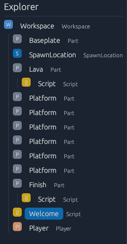
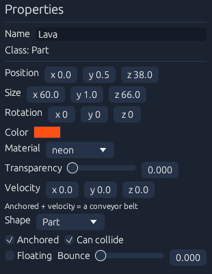
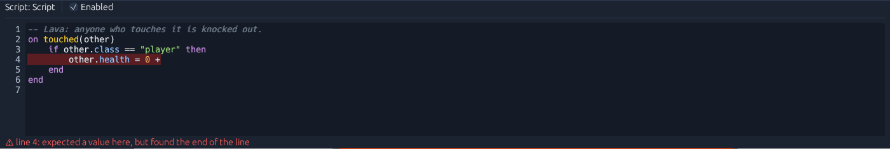
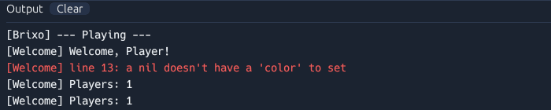

Open Brixo Studio. This page shows you around. It takes five minutes, and everything later in the guide assumes you know where these things are.

## The toolbar

Along the top, from left to right:

| Button | What it does |
|---|---|
| **▶ Play (F5)** | Runs your game so you can play it. Press again (**■ Stop**) to go back to building. Nothing you do while playing changes your game: Stop puts everything back. |
| **Players** | How many players Play starts. Set it to 2 or more to test multiplayer: you get a window per player. |
| **Move (1)**, **Rotate (2)**, **Scale (3)** | Which handles appear on the selected part. The number keys switch too. |
| **Snap** | Moves in whole studs and turns in 15° steps. Leave it on for neat building. |
| **Undo**, **Redo** | Ctrl+Z and Ctrl+Y (or Ctrl+Shift+Z). |
| **Add Part** | Adds a Part (a block), Wedge, Cylinder or Ball in front of the camera. Also has **Tool**, for things players hold. |
| **Add GUI** | Adds a TextLabel, TextButton or Frame: text and buttons on the players' screens. |
| **Edit** | Copy, paste, duplicate, group into a Model, ungroup, focus. |
| **Add Spawn** | Adds a SpawnLocation, where players appear. |
| **Add Script** | Adds a Script inside whatever's selected. |
| **Add Folder** | Adds a Folder, for keeping things organized. |
| **Delete** | Deletes what's selected (so does the Delete key). |
| **Save**, **Load** | Keeps your game on your computer and opens it again. |
| **Name** and **Publish** | The name players will see, and the button that puts your game on the website. |

## Moving around

While building, the camera flies freely:

| Keys | Camera |
|---|---|
| **W A S D** or **↑ ↓** | Fly forward, left, back, right |
| **Space** / **Shift** | Up / down |
| **Hold Ctrl** | Fly faster |
| **Right-drag** the mouse | Look around |
| **← →** and **Page Up / Page Down** | Turn and tilt (handy on a trackpad) |
| **Scroll** or pinch | Fly forward and back |
| **F** | Jump the camera to whatever's selected |

## The 3D view

**Click** a part to select it. Handles appear on it, for whichever tool is picked:

- **Move (1)**: drag an arrow to slide the part along it. Or drag the part itself (away from the arrows) and it slides over whatever's under the mouse, resting on top of it.
- **Rotate (2)**: drag a ring to turn the part.
- **Scale (3)**: drag a handle to make the part bigger or smaller on that side.

**Ctrl-click** selects more than one part, so you can move or copy them together. **Alt-click** picks a single part inside a Model.

## The Explorer

The Explorer lists **every object in your game** as a tree: things inside other things are indented under them. Each kind has its own colored badge.

- Click to select (the same as clicking in the 3D view).
- **Drag** an object onto another to move it inside. That's how you put a script into a part, or parts into a folder.
- **Double-click** or **F2** to rename. Names matter: scripts find things by name.
- **Right-click** for more: rename, duplicate, copy, paste into, group into a Model, ungroup and delete.

## Properties

Properties shows **everything about the selected object**, and lets you change it: name, position, size, rotation, color, material, shape, and switches like **Anchored** (stays put instead of falling) and **Can Collide** (solid, or something you walk through). Hover over any of them for a hint. Every property here can also be read and changed by scripts, with the same names in lowercase: `anchored`, `can_collide`, `color` and so on. See [Parts](parts).

## The script editor

Select a Script and the editor opens under the 3D view. It colors your code, numbers the lines, and **checks it as you type**: a mistake shows up in red, on its line, before you even press Play. It also suggests names as you type: use the arrow keys to choose one and **Tab** to accept.

## Output

Output is along the bottom. Anything a script `print`s shows up here, and so do errors, in red, with the script's name and the line number. **When something doesn't work, look here first.** See [Reading errors](errors).

## Sounds

To add music or a sound effect, **drag an mp3, wav or ogg file onto the Studio window**. It becomes a **Sound** in your game. See [Sounds and music](sounds).

Next: [Your first game](first-game).
