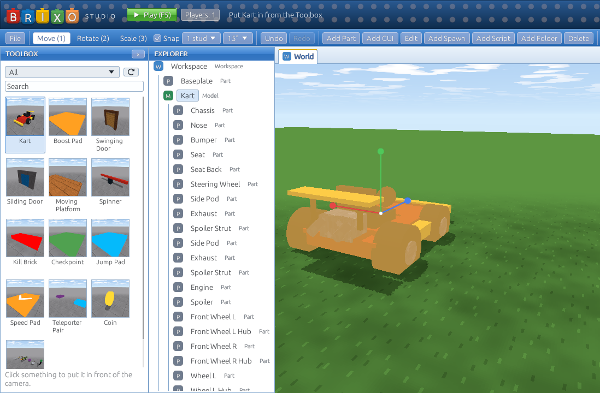

The **Toolbox** is a shelf of ready-made things for your games: a kart, doors, pads, checkpoints, teleporters, coins, weapons and more. Click one and it's in your game. Everything in it is ordinary parts and scripts, so once it's in, it's yours to change.

## Putting things in

The Toolbox is on the far left of Studio. (If it's hidden, press **Toolbox** on the blue bar.)

1. Pick a **category** from the list at the top, or type in the **Search** box. Hover over something to read what it does.
2. **Click it.** It's put in your game where the camera is looking, standing on the ground or on whatever part is there, and it's selected, so you can move it straight away.

You can put in as many copies as you like, and **Undo** (Ctrl+Z) takes one back out. Things can't be put in while you're playing: press **Stop** first.

## What's in it

| Category | Thing | What it does |
|---|---|---|
| Vehicles | **Car** | A car built from parts: walk into the seat to drive (**W**/**S**, **A**/**D**, **Space** to get out). Its script turns the wheels' motors: see [Vehicles](howto-vehicles). |
| Vehicles | **Kart** | A go-kart anyone can drive: walk up and press **F** (F again to get out). Drifts and boosts like [Brickport Speedway](howto-karts)'s. |
| Vehicles | **Boost Pad** | Karts that drive over it get a burst of speed. |
| Building | **Swinging Door** | A door on [hinges](howto-hinges) in its frame. Opens away from whoever walks into it, and closes behind them. |
| Building | **Sliding Door** | Slides up into the wall when someone walks into it. |
| Obby | **Moving Platform** | Glides back and forth, carrying whoever stands on it. |
| Obby | **Spinner** | A bar spinning on a post, sweeping players off. |
| Obby | **Kill Brick** | Touch it and you're out. |
| Obby | **Checkpoint** | You come back here when you respawn. |
| Gameplay | **Jump Pad** | Bounces players high into the air. |
| Gameplay | **Speed Pad** | Flings players the way its arrow points. |
| Gameplay | **Teleporter Pair** | Two pads: step on one, come out of the other. |
| Gameplay | **Coin** | Touch it for a coin. It comes back after 10 seconds. |
| Weapons | **Gear Kit** | The six weapons from [Tools and weapons](tools), given to every player when they join. |

The Toolbox comes from the Brixo website, so new things show up without updating Studio. (If Studio can't reach the website, it shows the things built into it.)

## Making them yours

There are no special settings: open a thing's **script** in the Explorer and change it. The scripts are short, and the numbers worth changing are at the top with a note saying what they do:

- **Jump Pad**: `power = 80` is how high. Try `150`.
- **Moving Platform**: `distance = 20` is how far it goes, `seconds = 6` how long a trip takes. It moves the way it **faces**, so turn it to send it another way.
- **Speed Pad**: turn the pad to aim it.
- **Checkpoint**: give each one a higher **stage** than the last. It's a custom field, so change it in **Properties**: the first is `1`, the next `2`, and so on.
- **Kart**: recolour its parts, or add a spoiler. Keep the part named **Chassis**: that's the part Brixo drives.

Recolour, resize and rename anything you like. Each thing's scripts only use `self` (the part or model they're in), never `find("...")`, so they keep working however many copies you put in, and whatever you call them. Keep that in mind if you edit them: a `find("Door")` would find the first door in the whole game, not this one.

They're also good to learn from. The Coin, the Kill Brick and the Jump Pad are a few lines each; the Kart and the Checkpoint show `on key` and `on respawned`.

## Adding to the Toolbox

For now, only Brixo's admins can add things to the Toolbox, since anything in it runs its scripts in everyone's games. Built something great that others would want? Tell us.
