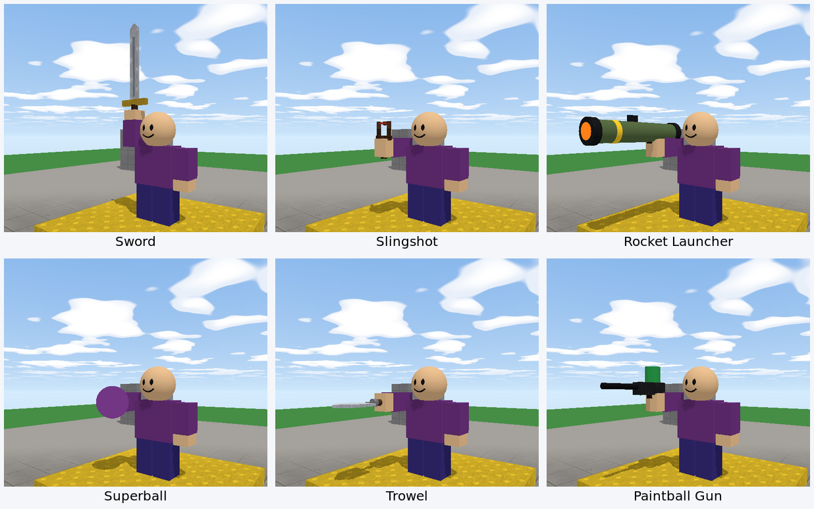

A **Tool** is something players hold: a sword, a gun, a trowel, a flashlight, a magic wand. Tools a player has sit in their **hotbar** at the bottom of the screen. Pressing **1** to **9** holds one (the same key again puts it away), and **clicking** uses it.



## Building a tool

1. **Add Part → Tool.** You get a **Tool** with one part inside it, called **Handle**.
2. The **first part** in a tool is the one the player's hand holds. Build the rest of the tool around it, **pointing along the blue arrow** (+z): that's the direction the tool will point when it's held out in front.
3. Add parts inside the Tool for the rest: a barrel, a blade, a sight. Keep the whole thing small: a sword is about 5 studs long, a gun 3 or 4.
4. Name it: the name shows in the hotbar.

> **Tip:** Cylinders stand upright (along their height). For a barrel or a handle that runs along the tool, set its **Rotation** x to `90`, so it lies along +z.

Most tools are held out in front. A tool with a custom field **`grip = "up"`** is held **straight up** instead, and chops forward when used, like a sword. Set it from a script inside the tool: `self.grip = "up"`.

## Giving tools to players

A tool **inside a player** is theirs: it's in their hotbar. Keep your finished tool in a **Storage** folder, and give each player a copy when they join:

```rovik run with=tool:Laser_Gun
on player_joined(p)
    gun = clone(find("Laser Gun"))
    gun.parent = p
end
```

Or make a pickup: a pad that hands one out when touched.

```rovik run in=part:Sword_Stand with=tool:Sword
on touched(other)
    if other.class == "player" then
        for t in other.children do
            if t.name == "Sword" then
                return      -- they already have one
            end
        end
        copy = clone(find("Sword"))
        copy.parent = other
        play_sound("buy", other)
    end
end
```

A player keeps their tools when they're knocked out. To take one away, `destroy` it.

## Using a tool: on activated

Put a script **inside the tool**. When the player holding it clicks, `on activated(p)` runs, with `p` the player holding it:

```rovik run in=tool:Magic_Wand
on activated(p)
    print(p.name + " waved the wand")
    p.face = "happy"
    play_sound("pop")
end
```

In a tool's script, `self` is the tool.

## Aiming where you click

When a player clicks with a tool, **`p.mouse`** is the spot in the world their mouse was pointing at: a wall, the ground, another player, or a point far away in the sky. Their character also turns to face it. That's how you aim:

```rovik run in=tool:Teleport_Wand
-- Click somewhere nearby to teleport there.
on activated(p)
    target = p.mouse
    dx = target.x - p.position.x
    dz = target.z - p.position.z
    if sqrt(dx * dx + dz * dz) < 40 then
        p.position = {x = target.x, y = target.y + 3, z = target.z}
        play_sound("whoosh")
    end
end
```

`p.look` is the flat direction they're facing, `{x, y = 0, z}`: useful for things that come out straight in front, like a sword swing or a wall.

## Shooting something

To fire a projectile: make a part, put it just in front of the player, point its `velocity` at `p.mouse`, and give it a script (or a `touched` handler) for what happens when it hits. The complete version, with damage, cooldowns and teams, is in [Make your own gun](howto-gun). The short version:

```rovik run in=tool:Snowball_Launcher
on activated(p)
    -- Start 3 studs in front, at chest height.
    f = p.look
    from = {x = p.position.x + f.x * 3, y = p.position.y + 1, z = p.position.z + f.z * 3}
    -- Aim at the click: the direction from there to p.mouse, made 1 long.
    t = p.mouse
    dx = t.x - from.x
    dy = t.y - from.y
    dz = t.z - from.z
    d = max(sqrt(dx * dx + dy * dy + dz * dz), 0.01)

    ball = create("Part", find("Workspace"))
    ball.name = "Snowball"
    ball.shape = "ball"
    ball.size = {x = 1, y = 1, z = 1}
    ball.color = {r = 240, g = 245, b = 255}
    ball.position = from
    ball.anchored = false
    ball.velocity = {x = dx / d * 80, y = dy / d * 80, z = dz / d * 80}
    play_sound("twang")
end
```

## Cooldowns

Without a cooldown, players can click as fast as they like. Remember when the tool was last used and ignore clicks that come too soon:

```rovik run in=tool:Blaster
ready_at = 0
on activated(p)
    if time() < ready_at then
        return          -- still reloading
    end
    ready_at = time() + 1.5
    print("Pew!")
end
```

## Brixo's gear kit

Flagfall and Spire Wars use Brixo's standard **gear kit**: Sword, Slingshot, Rocket Launcher, Superball, Trowel and Paintball Gun, balanced to play well together. You can download the **Gear Range** map, open it in Studio and read their scripts: they use everything on this page, plus teams and knockout credit (`last_hit_by`). See [The sample games, explained](samples).

Next: [Sounds and music](sounds).
