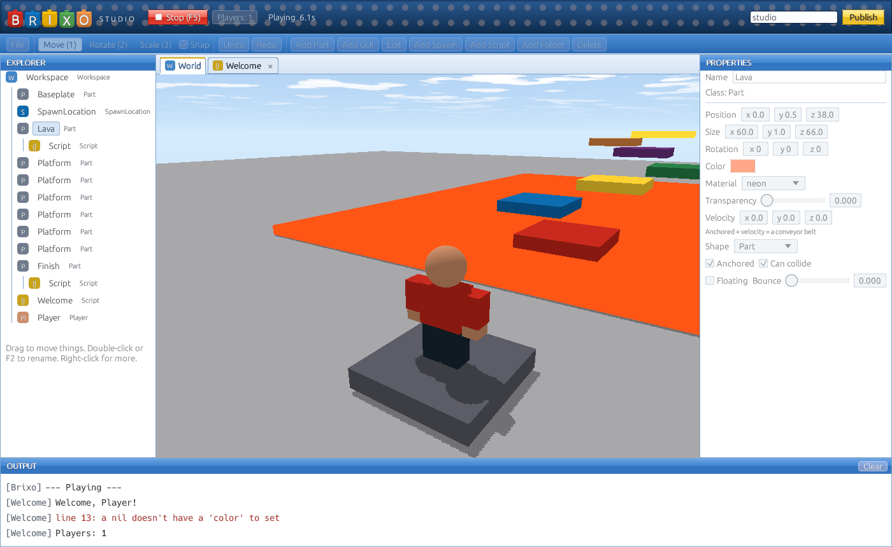

Brixo is a place to **build games and play them with your friends**. You make a game in **Brixo Studio**: build a world out of bricks, then bring it to life with short scripts written in **Rovik**, Brixo's own scripting language. Press **Publish** and it's on playbrixo.com, where anyone can press **Play** and join you.

This guide teaches all of it, from your first brick to a full team game with weapons, rounds and a scoreboard. You don't need to have programmed before.



## How this guide works

It's in five parts. Read the first two in order; after that, jump around.

- **[Getting started](install)**: install Studio, learn your way around, and make and publish a small game in about 15 minutes.
- **[Scripting with Rovik](rovik-basics)**: the language, one idea at a time: values, decisions, loops, lists, functions and events.
- **[Building worlds](parts)** and **[Players and interface](players)**: everything your scripts can touch, from parts and explosions to players, on-screen text, weapons and music.
- **[How-tos](howto-kill-brick)**: complete recipes for the things every game needs: kill bricks, coins, doors, teleporters, checkpoints, shops, rounds, teams and guns. Copy them, then change them.
- **[Reference](ref-language)**: every function, event and property, in one place, for when you know what you want and just need the name.

Every code example in this guide is **checked by Brixo's tests**: they're run in a real game every time Brixo is built, so if it's in here, it works. Each code box has a **Copy** button in its corner.

## What a Brixo game is made of

Everything in a game is an **object**: a brick, a folder, a script, a player, a line of text on the screen. Objects sit inside other objects, like files in folders, and all of them live in the **Workspace**. The most important kinds:

| Object | What it is |
|---|---|
| **Part** | A brick: a block, wedge, cylinder or ball. Walls, floors, coins, doors, everything you see. |
| **SpawnLocation** | A pad where players appear. |
| **Model** | A group of parts glued together, like a car or a tree. |
| **Folder** | A box for keeping things organized. |
| **Script** | Rovik code. A script runs when the game starts, and does things to the object it's inside. |
| **Tool** | Something a player holds: a sword, a gun, a trowel. |
| **TextLabel**, **TextButton**, **Frame** | Text, buttons and boxes on the players' screens. |
| **Sound** | An audio file you dropped into your game. |
| **Player** | Someone playing. Brixo adds these when people join. |

A tiny example. Put this script inside a part, press Play, and the part turns red and spins:

```rovik run in=part:Spinner
self.color = {r = 220, g = 40, b = 40}

every 0.03 seconds
    self.rotation.y += 4
end
```

`self` is the part the script is inside. `every 0.03 seconds` repeats the code in it, about 33 times a second, forever. That's most of what scripting is: **find an object, change it, and decide when**.

> **Ready?** Start with [Get Brixo Studio](install).
